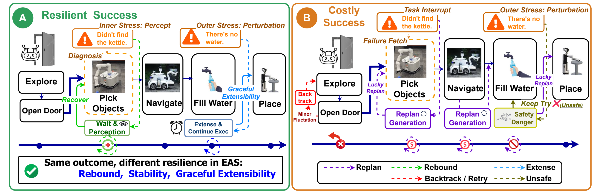
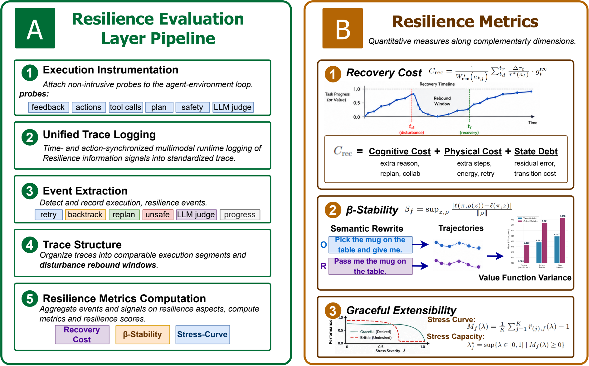
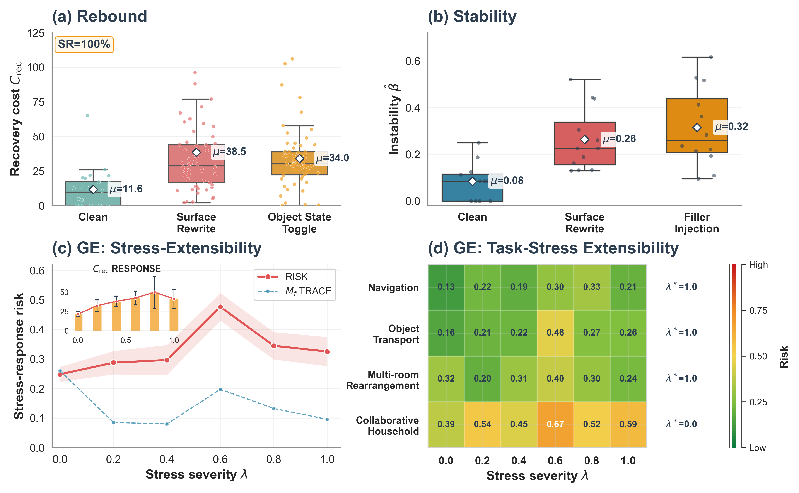
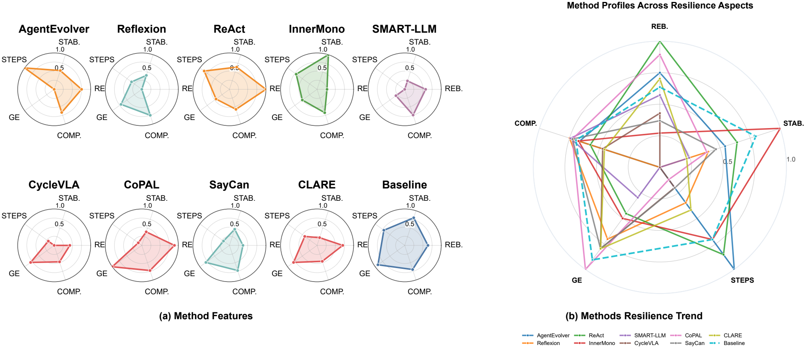
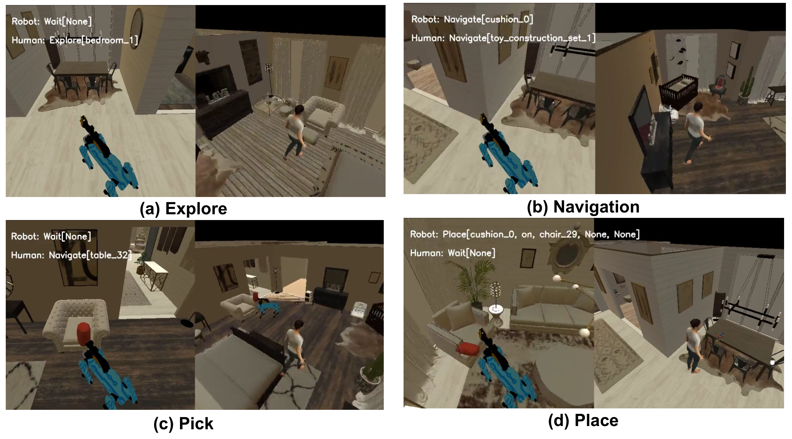

<p align="center">
  
</p>

<h1 align="center">Resilience Evaluation for Embodied Agent Systems</h1>

<p align="center">
  <b>Process-aware evaluation across Rebound, Stability, and Graceful Extensibility.</b>
</p>

<p align="center">
  <a href="https://6954717a.github.io/resilience_evaluation_web/" title="Open the project website"></a>&nbsp;&nbsp;
  <a href="https://6954717a.github.io/resilience_evaluation_web/run.html" title="Open the runbook"></a>&nbsp;&nbsp;
  <a href="https://github.com/6954717a/Resilience-Eval-eas" title="Open the source repository"></a>
</p>

---

## Why Resilience Evaluation

Outcome-centric metrics such as success rate tell us whether an embodied-agent episode ended well. They do not reveal whether the agent recovered efficiently, remained stable under small perturbations, or preserved bounded behavior as task stress increased. Two agents can reach the same task outcome while following very different resilience paths.

Resilience Evaluation brings ideas from resilience engineering into embodied-agent-system evaluation. The layer instruments execution without redefining the task, then turns process traces into three complementary views:

- **Rebound:** how much additional cognitive, physical, and state-debt work is required to recover after a local disruption.
- **Stability:** how sensitive policy and value trajectories are to controlled semantic or execution perturbations.
- **Graceful Extensibility:** how much operating margin remains as task stress increases, and where the execution contract stops holding.

<p align="center">
  
</p>

<p align="center">
  <b>Figure 1.</b> Outcome-centric evaluation hides differences in recovery, instability, and stress response that are visible in the execution process.
</p>

---

## Main Evaluation Line

```text
execution traces
  -> synchronized event evidence
  -> stage baselines and perturbation windows
  -> C_rec, beta, M_f(lambda), lambda_f^*
  -> method-level resilience profile
```

| Aspect | Main output | What it measures | Main evidence |
|:--|:--|:--|:--|
| Rebound | `C_rec` | Additional work needed to recover after a disruption. | Recovery windows, action/state debt, and paired perturbation evidence. |
| Stability | `beta` | Change in policy/value behavior under a controlled perturbation. | Clean-versus-perturbed trajectories and critic/value diagnostics. |
| Graceful Extensibility | `M_f(lambda)`, `lambda_f^*` | Remaining stress-response margin and the largest supported stress level. | Cross-run stress sweeps, task-family margins, and boundary diagnostics. |

The three aspects are complementary. Rebound describes recovery cost, Stability describes sensitivity around an operating point, and Graceful Extensibility describes capacity across increasing stress. A particular sweep configuration is therefore an execution profile of the framework, not the definition of Resilience Evaluation itself.

---

## Evaluation Pipeline

<p align="center">
  
</p>

<p align="center">
  <b>Figure 2.</b> Non-intrusive probes preserve execution evidence, identify resilience events, and produce process-aware metrics and profiles.
</p>

| Layer | Role | Main location |
|:--|:--|:--|
| Runtime evidence | Captures planner, critic, simulator, perturbation, and episode evidence. | `ResilienceEvaluationLayer/evaluation/`, `ResilienceEvaluationLayer/conf/` |
| Stage-aware alignment | Keeps Judge-scoped stage baselines and aligns clean/perturbed evidence. | `ResilienceEvaluationLayer/evaluation/stage_baseline/` |
| Metric extraction | Computes Rebound, Stability, and Graceful Extensibility evidence. | `ResilienceEvaluationLayer/evaluation/metrics/` |
| Reporting and analysis | Produces episode rows, aggregate tables, profiles, and figures. | `ResilienceEvaluationLayer/evaluation/reporting/`, `Analysis_Code/` |

Runtime evidence remains separate from statistical post-processing. In particular, formal Graceful Extensibility is calculated across clean/stress neighborhoods rather than being treated as a fourth per-step runtime monitor.

---

## Evidence: What the Layer Reveals

### Metric Validity

The validity study asks whether the three resilience aspects distinguish process behavior that task success alone misses.

<p align="center">
  
</p>

<p align="center">
  <b>Figure 3.</b> Different perturbation families expose different parts of the resilience profile.
</p>

- Rebound responds to disruptions that create additional recovery work, even when an episode can still complete.
- Stability separates clean execution from small semantic or execution perturbations through trajectory-level change.
- Graceful Extensibility exposes the shape and boundary of stress response instead of reducing behavior to one success-rate value.

### Benchmark Profiles

The benchmark view compares embodied-agent methods on the same process-aware surface.

<p align="center">
  
</p>

<p align="center">
  <b>Figure 4.</b> Methods with similar task outcomes can exhibit very different recovery costs, stability signatures, and stress capacity.
</p>

For example, packaged results give CoPAL and Reflexion similar success rates (`55.8` and `56.3`) but very different recovery costs (`C_rec = 11.9` and `57.3`). The resilience layer exposes this process difference instead of flattening both methods into a similar outcome score.

### Targeted Evaluation and Optimization

Targeted studies use the evaluation layer to ask whether changing one part of an embodied-agent system changes the intended resilience aspect. They are applications of the framework, not its organizing principle.

| Target | Baseline | Targeted variant | Main observation |
|:--|:--|:--|:--|
| Rebound | `C_rec = 54.31`, completion `0.967` | `C_rec = 16.48`, completion `1.000` | Recovery cost falls without reducing completion. |
| Stability | `beta_step = 0.400`, completion `0.886` | `beta_step = 0.244`, completion `0.929` | Local replanning variance is reduced. |
| Graceful Extensibility | Completion `0.833`; formal GE incomplete | Completion `0.917`; pilot GE | Pilot evidence improves, while a formal optimized-versus-baseline capacity claim remains incomplete. |

The Graceful Extensibility row is intentionally qualified as pilot evidence; it is not presented as a completed formal capacity proof.

---

## Runtime Context

The implementation is based on the Habitat 3.0 stack, with Habitat-Sim 0.3.3 in the pinned PARTNR-compatible runtime. Resilience Evaluation uses the existing embodied-agent task and execution interfaces, adds process-aware probes and a Judge-backed critic, and aggregates episode-level evidence without turning this repository into a standalone PARTNR distribution.

<p align="center">
  
</p>

<p align="center">
  <b>Figure 5.</b> Habitat-Sim execution context for the embodied-agent traces evaluated by the resilience layer.
</p>

---

## Run and Reproduce

This repository is an evaluation overlay. It does not bundle PARTNR's third-party modules, Habitat assets, datasets, or the frozen perturbation bank.

1. Complete the overlay and dependency setup in [INSTALLATION.md](INSTALLATION.md).
2. Use the [Web Runbook](https://6954717a.github.io/resilience_evaluation_web/run.html) for the current planner/Judge endpoint setup and executable commands.
3. Select the EAS case, a resilience evaluation profile, or the PARTNR benchmark according to the evaluation question.

The current joint configuration includes a multi-episode, multi-seed stress sweep. That grid is a reproducible reference case for the implementation; it is not the conceptual scope of Resilience Evaluation.

<details>
<summary><b>Current configuration and output references</b></summary>

| Purpose | Current entry point |
|:--|:--|
| EAS case and PARTNR benchmark | [`qwen35_centralized_zero_shot_react_summary_vllm.yaml`](ResilienceEvaluationLayer/conf/baselines/qwen35_centralized_zero_shot_react_summary_vllm.yaml) |
| Joint resilience reference case | [`resilience_joint_qwen35.yaml`](ResilienceEvaluationLayer/conf/experiments/resilience_joint_qwen35.yaml) |
| Resilience defaults and lifecycle | [`resilience_config.yaml`](ResilienceEvaluationLayer/conf/evaluation/resilience_config.yaml) |
| Centralized evaluation runner | [`centralized_evaluation_runner_motortoolsonly_multiagent.yaml`](ResilienceEvaluationLayer/conf/evaluation/centralized_evaluation_runner_motortoolsonly_multiagent.yaml) |

| Run | Primary output |
|:--|:--|
| EAS case | `results/episode_result_log.csv` |
| Joint resilience reference case | `joint_resilience_evaluation/raw_rollouts.csv` and `summary.csv` |
| Stress-boundary summary | `joint_resilience_evaluation/boundary_capacity_summary.csv` |
| Isolated-worker benchmark | `results/mp_workers/execution_manifest.json` |

</details>

Packaged analysis code and data support table/figure regeneration, but remain supplementary to the Resilience Evaluation main line.

---

## Repository Layout

| Path | Role |
|:--|:--|
| `ResilienceEvaluationLayer/` | PARTNR-compatible runtime overlay, resilience metrics, monitors, planners, configs, and tests. |
| `Analysis_Code/` | Supplementary offline aggregation, verification, tables, and figure generation. |
| `Analysis_Data/` | Packaged experiment inputs and selected execution evidence. |
| `Analysis_Results/` | Derived tables and media. |
| `Reproduction/` | Historical compact reproduction snapshot; not the source of truth for current runtime configs. |
| [`doc/`](doc/README.md) | Figure assets, vector sources, and the documentation index. |

---

## References

- [Habitat-Sim](https://github.com/facebookresearch/habitat-sim)
- [Habitat-Lab](https://github.com/facebookresearch/habitat-lab)
- [PARTNR Planner](https://github.com/facebookresearch/partnr-planner)

## Acknowledgments

- Built on the embodied-agent evaluation stack around Habitat-LLM and PARTNR-style task execution.
- The framing is inspired by process-aware resilience analysis and resilience-engineering concepts.
